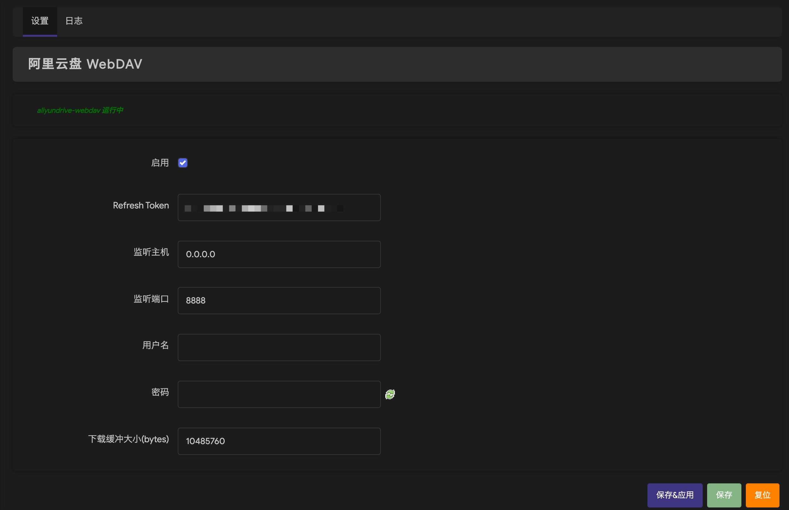
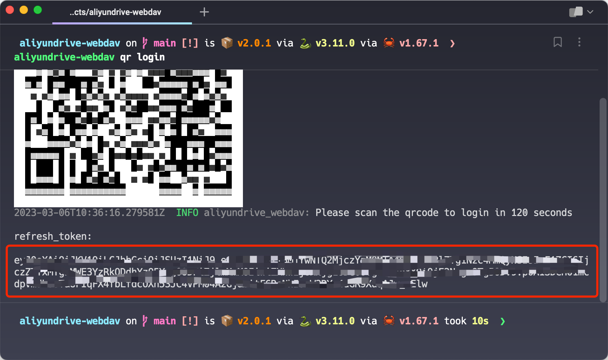

# aliyundrive-webdav

[](https://github.com/messense/aliyundrive-webdav/actions?query=workflow%3ACI)
[](https://pypi.org/project/aliyundrive-webdav)
[](https://hub.docker.com/r/messense/aliyundrive-webdav/)
[](https://snapcraft.io/aliyundrive-webdav)
[](https://crates.io/crates/aliyundrive-webdav)

> 🚀 Help me to become a full-time open-source developer by [sponsoring me on GitHub](https://github.com/sponsors/messense)

阿里云盘 WebDAV 服务，主要使用场景为配合支持 WebDAV 协议的客户端 App 如 [Infuse](https://firecore.com/infuse)、[nPlayer](https://nplayer.com)
等实现在电视上直接观看云盘视频内容， 支持客户端 App 直接从阿里云盘获取文件播放而不经过运行本应用的服务器中转, 支持上传文件，但受限于 WebDAV 协议不支持文件秒传。

**请注意：V2 版本基于阿里云盘开放平台接口实现，不再支持阿里云盘 Web 和 App 版本获取的 refresh token。**
**由于本项目作者不再使用梅林固件，V2 版本不再免费支持 Koolshare 梅林固件系统，如有需要请考虑[付费支持](https://github.com/messense/aliyundrive-webdav/discussions/778)。**

如果项目对你有帮助，请考虑[捐赠支持](https://github.com/messense/aliyundrive-webdav/discussions/126)项目持续维护。
也可以考虑加入[aliyundrive-webdav 知识星球](https://t.zsxq.com/0c9sq6Ca8)获取咨询和技术支持服务。

> **Note**
>
> 本项目作者没有上传需求, 故上传文件功能测试不全面且没有持续迭代计划.

## 安装

可以从 [GitHub Releases](https://github.com/messense/aliyundrive-webdav/releases) 页面下载预先构建的二进制包， 也可以使用 pip 从 PyPI 下载:

```bash
pip install aliyundrive-webdav
```

如果系统支持 [Snapcraft](https://snapcraft.io) 比如 Ubuntu、Debian 等，也可以使用 snap 安装：

```bash
sudo snap install aliyundrive-webdav
```

### OpenWrt 路由器

[GitHub Releases](https://github.com/messense/aliyundrive-webdav/releases) 中有预编译的 ipk 文件， 目前提供了
aarch64/arm/mipsel/x86_64/i686 等架构的版本，可以下载后使用 opkg 安装，以 nanopi r4s 为例：

```bash
wget https://github.com/messense/aliyundrive-webdav/releases/download/v2.3.3/aliyundrive-webdav_2.3.3-1_aarch64_generic.ipk
wget https://github.com/messense/aliyundrive-webdav/releases/download/v2.3.3/luci-app-aliyundrive-webdav_2.3.3_all.ipk
wget https://github.com/messense/aliyundrive-webdav/releases/download/v2.3.3/luci-i18n-aliyundrive-webdav-zh-cn_2.3.3-1_all.ipk
opkg install aliyundrive-webdav_2.3.3-1_aarch64_generic.ipk
opkg install luci-app-aliyundrive-webdav_2.3.3_all.ipk
opkg install luci-i18n-aliyundrive-webdav-zh-cn_2.3.3-1_all.ipk
```

其它 CPU 架构的路由器可在 [GitHub Releases](https://github.com/messense/aliyundrive-webdav/releases) 页面中查找对应的架构的主程序 ipk 文件下载安装， 常见
OpenWrt 路由器 CPU 架构如下表（欢迎补充）：

| 路由器       | CPU 架构           |
| ------------ | ------------------ |
| nanopi r4s   | aarch64_generic    |
| 小米 AX3600  | aarch64_cortex-a53 |
| 斐讯 N1 盒子 | aarch64_cortex-a53 |
| Newifi D2    | mipsel_24kc        |
| Pogoplug     | arm_mpcore         |

> Tips: 不清楚 CPU 架构类型可通过运行 `opkg print-architecture` 命令查询。



## Docker 运行

```bash
docker run -d --name=aliyundrive-webdav --restart=unless-stopped -p 8080:8080 \
  -v /etc/aliyundrive-webdav/:/etc/aliyundrive-webdav/ \
  -e REFRESH_TOKEN='your refresh token' \
  -e WEBDAV_AUTH_USER=admin \
  -e WEBDAV_AUTH_PASSWORD=admin \
  messense/aliyundrive-webdav
```

其中，`REFRESH_TOKEN` 环境变量为你的阿里云盘 `refresh_token`，`WEBDAV_AUTH_USER`
和 `WEBDAV_AUTH_PASSWORD` 为连接 WebDAV 服务的用户名和密码。

### QNAP 威联通 NAS

#### QNAP 插件

[qnap-aliyunpan-webdav](https://github.com/iranee/qnap-aliyunpan-webdav) by
[@iranee](https://github.com/iranee).

#### ContainerStation (Docker)

管理员登陆 NAS 后安装 ContainerStation 并启动服务，在 Management (管理) 标签中 Create Application (新建应用)，配置如下

```yaml
version: '3.3'
services:
  aliyundrive-webdav:
    container_name: aliyundrive-webdav
    restart: unless-stopped
    ports:
      - '8080:8080'
    environment:
      - 'REFRESH_TOKEN=mytoken...'
    image: messense/aliyundrive-webdav
```

其中 `REFRESH_TOKEN` 文档最下面说明；`:8080` 网盘访问映射端口，可以按需改为其他的。

点击 Create (创建)后启动，访问 http://nas地址:8080/ 即可看到你网盘的自动生成索引网页文件。

参考文档

- https://docs.docker.com/compose/
- https://www.composerize.com/

## rclone

为了避免重复上传文件，使用 rclone 时推荐使用 [Nextcloud WebDAV](https://rclone.org/webdav/#nextcloud) 模式，可以支持 sha1 checksums. 
另外需要配合 `--no-update-modtime` 参数，否则 rclone 为了更新文件修改时间还是会强制重新上传。

举个例子：

```bash
rclone --no-update-modtime copy abc.pdf aliyundrive-nc://docs/
```

## 获取 refresh token

* [通过在线工具获取 refresh token](https://messense-aliyundrive-webdav-backendrefresh-token-ucs0wn.streamlit.app/)
* 命令行运行 `aliyundrive-webdav qr login` 扫码授权后会输出 refresh token



## 命令行用法

```bash
$ aliyundrive-webdav --help
WebDAV server for AliyunDrive

Usage: aliyundrive-webdav [OPTIONS]
       aliyundrive-webdav <COMMAND>

Commands:
  qr    Scan QRCode
  help  Print this message or the help of the given subcommand(s)

Options:
      --host <HOST>
          Listen host

          [env: HOST=]
          [default: 0.0.0.0]

  -p, --port <PORT>
          Listen port

          [env: PORT=]
          [default: 8080]

      --client-id <CLIENT_ID>
          Aliyun drive client_id

          [env: CLIENT_ID=]

      --client-secret <CLIENT_SECRET>
          Aliyun drive client_secret

          [env: CLIENT_SECRET=]

      --drive-type <DRIVE_TYPE>
          Aliyun drive type

          [env: DRIVE_TYPE=]

          Possible values:
          - resource: Resource drive
          - backup:   Backup drive
          - default:  Default drive

  -r, --refresh-token <REFRESH_TOKEN>
          Aliyun drive refresh token

          [env: REFRESH_TOKEN=]

  -U, --auth-user <AUTH_USER>
          WebDAV authentication username

          [env: WEBDAV_AUTH_USER=]

  -W, --auth-password <AUTH_PASSWORD>
          WebDAV authentication password

          [env: WEBDAV_AUTH_PASSWORD=]

  -I, --auto-index
          Automatically generate index.html

  -S, --read-buffer-size <READ_BUFFER_SIZE>
          Read/download buffer size in bytes, defaults to 10MB

          [default: 10485760]

      --upload-buffer-size <UPLOAD_BUFFER_SIZE>
          Upload buffer size in bytes, defaults to 16MB

          [default: 16777216]

      --cache-size <CACHE_SIZE>
          Directory entries cache size

          [default: 1000]

      --cache-ttl <CACHE_TTL>
          Directory entries cache expiration time in seconds

          [default: 600]

      --root <ROOT>
          Root directory path

          [env: WEBDAV_ROOT=]
          [default: /]

  -w, --workdir <WORKDIR>
          Working directory, refresh_token will be stored in there if specified

      --no-trash
          Delete file permanently instead of trashing it

      --read-only
          Enable read only mode

      --tls-cert <TLS_CERT>
          TLS certificate file path

          [env: TLS_CERT=]

      --tls-key <TLS_KEY>
          TLS private key file path

          [env: TLS_KEY=]

      --strip-prefix <STRIP_PREFIX>
          Prefix to be stripped off when handling request

          [env: WEBDAV_STRIP_PREFIX=]

      --debug
          Enable debug log

      --no-self-upgrade
          Disable self auto upgrade

      --skip-upload-same-size
          Skip uploading same size file

      --prefer-http-download
          Prefer downloading using HTTP protocol

      --redirect
          Enable 302 redirect when possible

  -h, --help
          Print help (see a summary with '-h')

  -V, --version
          Print version
```

> **Note**
> 
> 注意：TLS/HTTPS 暂不支持 MIPS 架构。

> **Note**
> 
> 注意：启用 `--skip-upload-same-size` 选项虽然能加速上传但可能会导致修改过的同样大小的文件不会被上传

## License

This work is released under the MIT license. A copy of the license is provided in the [LICENSE](./LICENSE) file.
