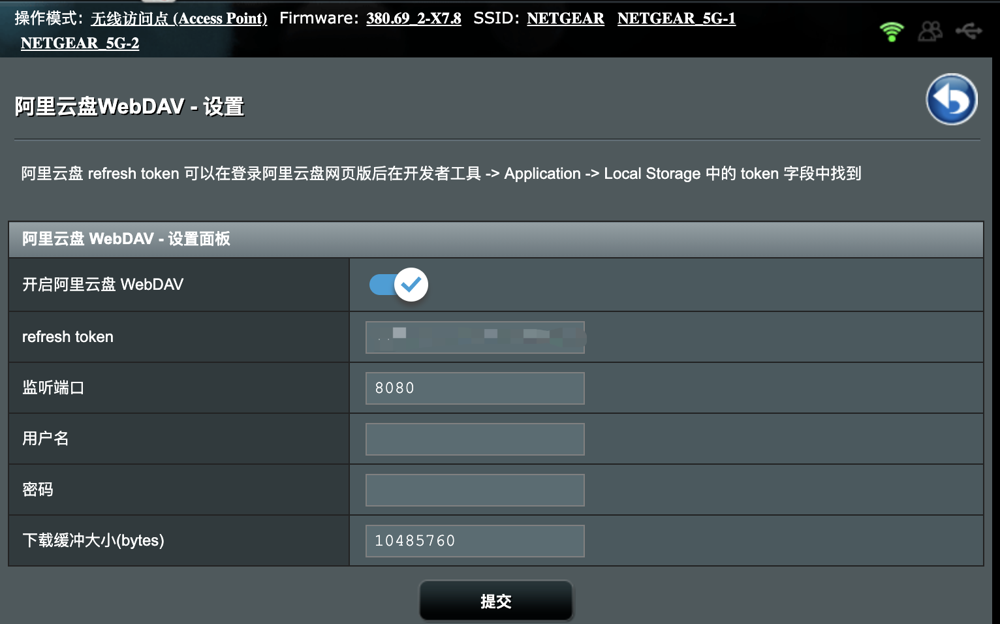
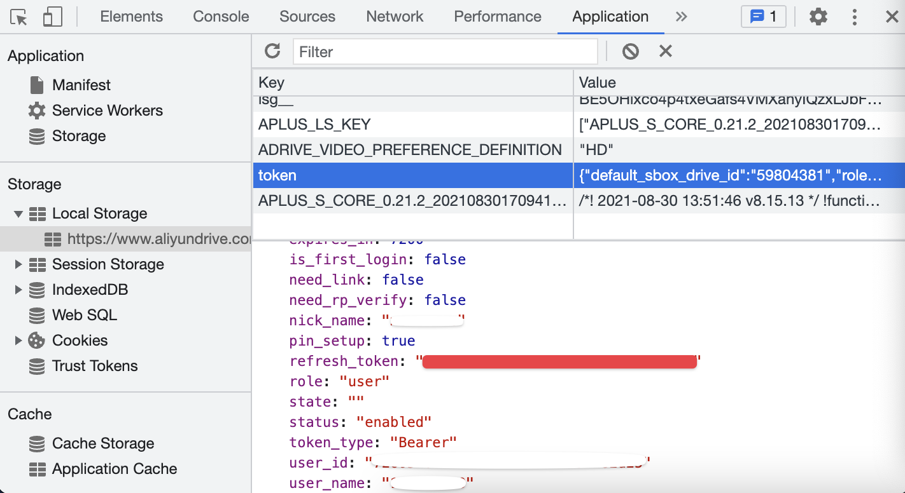

# aliyundrive-webdav

[](https://github.com/messense/aliyundrive-webdav/actions?query=workflow%3ACI)
[](https://pypi.org/project/aliyundrive-webdav)
[](https://hub.docker.com/r/messense/aliyundrive-webdav/)
[](https://snapcraft.io/aliyundrive-webdav)
[](https://crates.io/crates/aliyundrive-webdav)

> 🚀 Help me to become a full-time open-source developer by [sponsoring me on GitHub](https://github.com/sponsors/messense)

阿里云盘 WebDAV 服务，主要使用场景为配合支持 WebDAV 协议的客户端 App 如 [Infuse](https://firecore.com/infuse)、[nPlayer](https://nplayer.com)
等实现在电视上直接观看云盘视频内容， 支持上传文件，但受限于 WebDAV 协议不支持文件秒传。

如果你使用 Emby 或者 Jellyfin，也可以试试 [aliyundrive-fuse](https://github.com/messense/aliyundrive-fuse) 项目。

如果项目对你有帮助，请考虑[捐赠支持](https://github.com/messense/aliyundrive-webdav/discussions/126)项目持续维护。

## 安装

可以从 [GitHub Releases](https://github.com/messense/aliyundrive-webdav/releases) 页面下载预先构建的二进制包， 也可以使用 pip 从 PyPI 下载:

```bash
pip install aliyundrive-webdav
```

如果系统支持 [Snapcraft](https://snapcraft.io) 比如 Ubuntu、Debian 等，也可以使用 snap 安装：

```bash
sudo snap install aliyundrive-webdav
```

### OpenWrt 路由器

[GitHub Releases](https://github.com/messense/aliyundrive-webdav/releases) 中有预编译的 ipk 文件， 目前提供了
aarch64/arm/mipsel/x86_64/i686 等架构的版本，可以下载后使用 opkg 安装，以 nanopi r4s 为例：

```bash
wget https://github.com/messense/aliyundrive-webdav/releases/download/v1.2.7/aliyundrive-webdav_1.2.7-1_aarch64_generic.ipk
wget https://github.com/messense/aliyundrive-webdav/releases/download/v1.2.7/luci-app-aliyundrive-webdav_1.2.7_all.ipk
wget https://github.com/messense/aliyundrive-webdav/releases/download/v1.2.7/luci-i18n-aliyundrive-webdav-zh-cn_1.2.7-1_all.ipk
opkg install aliyundrive-webdav_1.2.7-1_aarch64_generic.ipk
opkg install luci-app-aliyundrive-webdav_1.2.7_all.ipk
opkg install luci-i18n-aliyundrive-webdav-zh-cn_1.2.7-1_all.ipk
```

其它 CPU 架构的路由器可在 [GitHub Releases](https://github.com/messense/aliyundrive-webdav/releases) 页面中查找对应的架构的主程序 ipk 文件下载安装， 常见
OpenWrt 路由器 CPU 架构如下表（欢迎补充）：

|      路由器     |        CPU 架构       |
|----------------|----------------------|
| nanopi r4s     | aarch64_generic      |
| 小米 AX3600     | aarch64_cortex-a53  |
| 斐讯 N1 盒子    | aarch64_cortex-a53   |
| Newifi D2      | mipsel_24kc          |
| Pogoplug       | arm_mpcore           |

> Tips: 不清楚 CPU 架构类型可通过运行 `opkg print-architecture` 命令查询。


### Koolshare 梅林固件

[GitHub Releases](https://github.com/messense/aliyundrive-webdav/releases) 中有预编译包 `aliyundrivewebdav-merlin-arm*.tar.gz`
， 目前提供了旧的 arm380 和兼容 arm384/386 固件的版本，可在下载后在软件中心离线安装。



## Docker 运行

```bash
docker run -d --name=aliyundrive-webdav --restart=unless-stopped -p 8080:8080 \
  -v /etc/aliyundrive-webdav/:/etc/aliyundrive-webdav/ \
  -e REFRESH_TOKEN='your refresh token' \
  -e WEBDAV_AUTH_USER=admin \
  -e WEBDAV_AUTH_PASSWORD=admin \
  messense/aliyundrive-webdav
```

其中，`REFRESH_TOKEN` 环境变量为你的阿里云盘 `refresh_token`，`WEBDAV_AUTH_USER`
和 `WEBDAV_AUTH_PASSWORD` 为连接 WebDAV 服务的用户名和密码。

### QNAP 威联通 NAS

#### QNAP 插件

[qnap-aliyunpan-webdav](https://github.com/iranee/qnap-aliyunpan-webdav) by
[@iranee](https://github.com/iranee).

#### ContainerStation (Docker)

管理员登陆 NAS 后安装 ContainerStation 并启动服务，在 Management (管理) 标签中 Create Application (新建应用)，配置如下

```yaml
version: '3.3'
services:
  aliyundrive-webdav:
    container_name: aliyundrive-webdav
    restart: unless-stopped
    ports:
      - '8080:8080'
    environment:
      - 'REFRESH_TOKEN=mytoken...'
    image: messense/aliyundrive-webdav
```

其中 `REFRESH_TOKEN` 文档最下面说明；`:8080` 网盘访问映射端口，可以按需改为其他的。

点击 Create (创建)后启动，访问 http://nas地址:8080/ 即可看到你网盘的自动生成索引网页文件。

参考文档

- https://docs.docker.com/compose/
- https://www.composerize.com/

## 命令行用法

```bash
$ aliyundrive-webdav --help
aliyundrive-webdav 1.2.7

USAGE:
    aliyundrive-webdav [OPTIONS]

OPTIONS:
        --cache-size <CACHE_SIZE>                Directory entries cache size [default: 1000]
        --cache-ttl <CACHE_TTL>                  Directory entries cache expiration time in seconds [default: 600]
	--debug                                  Enable debug log
        --domain-id <DOMAIN_ID>                  Aliyun PDS domain id
    -h, --help                                   Print help information
        --host <HOST>                            Listen host [env: HOST=] [default: 0.0.0.0]
    -I, --auto-index                             Automatically generate index.html
        --no-trash                               Delete file permanently instead of trashing it
    -p, --port <PORT>                            Listen port [env: PORT=] [default: 8080]
    -r, --refresh-token <REFRESH_TOKEN>          Aliyun drive refresh token [env: REFRESH_TOKEN=]
        --read-only                              Enable read only mode
        --root <ROOT>                            Root directory path [default: /]
    -S, --read-buffer-size <READ_BUFFER_SIZE>    Read/download buffer size in bytes, defaults to 10MB [default: 10485760]
        --tls-cert <TLS_CERT>                    TLS certificate file path [env: TLS_CERT=]
        --tls-key <TLS_KEY>                      TLS private key file path [env: TLS_KEY=]
    -U, --auth-user <AUTH_USER>                  WebDAV authentication username [env: WEBDAV_AUTH_USER=]
    -V, --version                                Print version information
    -w, --workdir <WORKDIR>                      Working directory, refresh_token will be stored in there if specified
    -W, --auth-password <AUTH_PASSWORD>          WebDAV authentication password [env: WEBDAV_AUTH_PASSWORD=]
```

> 注意：TLS/HTTPS 暂不支持 MIPS 架构。

### 获取 refresh_token
* 自动获取: 登录[阿里云盘](https://www.aliyundrive.com/drive/)后，控制台粘贴 `JSON.parse(localStorage.token).refresh_token`


* 手动获取: 登录[阿里云盘](https://www.aliyundrive.com/drive/)后，可以在开发者工具 ->
Application -> Local Storage 中的 `token` 字段中找到。  
注意：不是复制整段 JSON 值，而是 JSON 里 `refresh_token` 字段的值，如下图所示红色部分：


## License

This work is released under the MIT license. A copy of the license is provided in the [LICENSE](./LICENSE) file.
